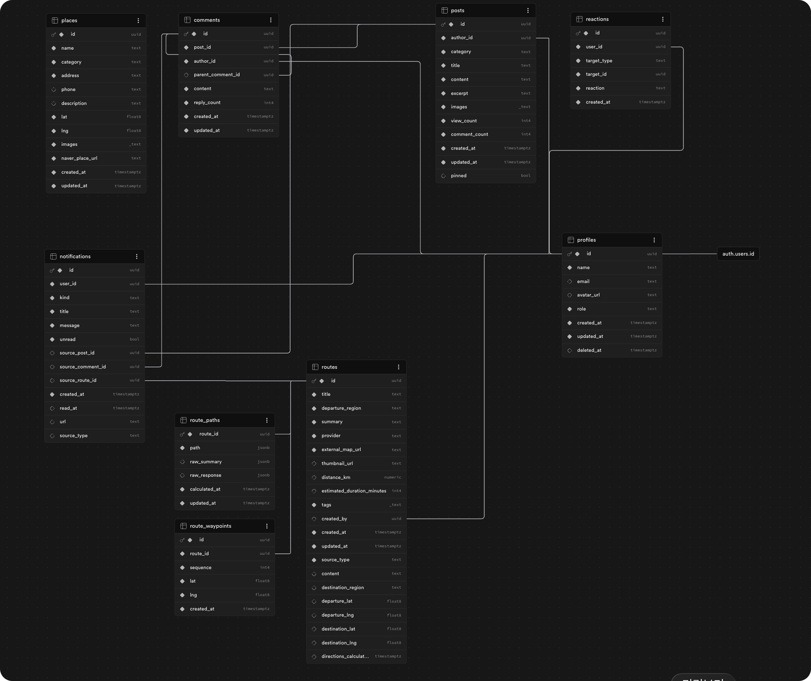

# Biker Map README.md

<strong>버전 : </strong> v2

<strong>생성 날짜 : </strong> 2026-04-15

<strong>최신 업데이트 날짜 : </strong> 2026-05-21

> 바이커를 위한 장소 탐색, 큐레이션 경로, 커뮤니티, 알림, 모바일 앱 확장을 하나의 계약으로 운영하는 모노레포입니다.

Biker Map은 단순 지도 앱이 아니라, **라이딩 경험을 기록하고 공유하기 위한 웹/앱 통합 서비스**입니다.
장소와 경로를 지도 위에 시각화하고, 커뮤니티 반응과 알림을 실시간에 가깝게 연결하며, 웹과 모바일이 같은 API 계약을 바라보도록 설계했습니다.

이 프로젝트는 개인 프로젝트이지만, 구조는 실제 서비스 운영을 전제로 잡았습니다.
기능 구현뿐 아니라 인증, RLS, 공통 타입, BFF, DB baseline, PR 리뷰, 에이전트 협업 문서까지 함께 관리합니다.

## 서비스 목적

바이커에게 친화적인 지도를 제공합니다.

- 어디가 바이크로 가기 좋은 장소인지
- 어떤 경로가 라이딩하기 좋은지
- 다른 라이더들이 어떤 장소와 경로를 추천하는지

Biker Map은 이 문제를 **지도 + 큐레이션 경로 + 커뮤니티 + 알림 + 모바일 확장성**으로 풀고 있습니다.

## Product Scope

### MVP

| 영역        | 기능                                            | 상태 |
| ----------- | ----------------------------------------------- | ---- |
| 인증        | 로그인, 회원가입, 로그아웃, 세션 복구           | 구현 |
| 지도        | 장소 marker, 경로 polyline, 카테고리 필터       | 구현 |
| 장소        | 관리자 place CRUD, 이미지 업로드                | 구현 |
| 경로        | 운영자 큐레이션 route CRUD, route detail        | 구현 |
| 커뮤니티    | 게시글, 댓글, 대댓글 작성/수정/삭제             | 구현 |
| 반응        | post/comment 좋아요, 싫어요                     | 구현 |
| 즐겨찾기    | post/route favorite, optimistic update          | 구현 |
| 알림        | post/comment/system 알림 분리, Realtime 수신    | 구현 |
| 마이페이지  | 내가 쓴 글, 좋아요 목록, 프로필 수정, 회원 탈퇴 | 구현 |
| 관리자      | place/route/post 관리 UI                        | 구현 |
| 정책 페이지 | 이용약관, 개인정보 처리방침, 문의               | 구현 |

### MVP 이후

| 영역        | 기능                                           | 방향                     |
| ----------- | ---------------------------------------------- | ------------------------ |
| 지도        | 네이버 외 지도 앱 선택 모달 (카카오맵, t맵 등) | 검토중                   |
| 사용자 경로 | 직접 만든 커스텀 route                         | 비용 제한 설계 후 재개   |
| 모바일 앱   | 라이더 간 실시간 채팅                          | 별도 WebSocket 서버 검토 |
| 모바일 앱   | 실시간 위치 공유                               | SDK/WebSocket 검토       |
| 모바일 앱   | 같이 라이딩하기, 중간 지점 추천                | 앱 전용 기능 후보        |
| 운영        | Sentry, 배포 리스크 점검, 인프라 이전          | 검토 중                  |

## Tech Stack

| 영역            | 기술                                                        |
| --------------- | ----------------------------------------------------------- |
| Web             | Next.js 16, React 19, TypeScript, Tailwind CSS 4            |
| Server State    | TanStack Query                                              |
| Validation      | Zod                                                         |
| Backend         | Supabase Auth, Postgres, Storage, Realtime                  |
| Mobile          | Expo, Expo Router, React Native, TypeScript                 |
| Shared Contract | `package-shared`                                            |
| Markdown        | `@uiw/react-md-editor`, `react-markdown`, `rehype-sanitize` |
| Maps            | Naver Map 기반 geocoding, directions, dynamic map           |

<br/>

## Repository Structure

```text
biker-map/
├─ web/                 Next.js 웹 앱과 BFF API route
├─ mobile/              Expo Router 기반 모바일 앱
├─ package-shared/      웹/앱 공통 타입, 상수, API path, 계약 문서
├─ supabase/            baseline, migration, Storage/RLS/Auth 관련 SQL
├─ design/              디자인 시스템과 화면 설계 문서
├─ .codex/              프로젝트 로컬 agent, skill, 협업 지침
├─ AGENTS.md            Biker Map 에이전트 공통 작업 규칙
└─ README.md
```

### BFF 중심 설계

`web/app/api/**/route.ts`는 Biker Map의 BFF 계층입니다.

- 클라이언트는 Supabase table이나 비용성 외부 API를 직접 다루지 않습니다.
- API route에서 request validation, session 확인, owner/admin authorization, response mapping을 수행합니다.
- Supabase row를 그대로 반환하지 않고 웹/앱이 함께 소비할 contract에 맞춰 반환합니다.
- Naver geocoding, directions 같은 비용성 API는 BFF에서 호출합니다.

### Supabase와 RLS

Supabase는 Auth, Postgres, Storage, Realtime을 담당합니다.

- RLS는 DB level의 최종 방어선입니다.
- BFF authorization은 비즈니스 권한과 사용자-facing error response를 담당합니다.
- service role은 notification writer, count sync, auth admin처럼 시스템 권한이 필요한 경우에만 사용합니다.
- live DB 기준은 `supabase/baseline/current`로 정리하고, baseline 이후 변경은 migration으로 관리합니다.

<br/>

## Source of Truth

이 프로젝트는 웹과 앱에서 도메인 엔티티 고정 source of truth를 명시적으로 관리합니다.

### `web`

- 현재 실제 API route, 인증, 세션, Supabase 연동의 기준 구현은 `web`입니다.
- 다만 모바일 앱 전용 기능의 경우는 설계 문서를 기준으로 구현됩니다.

### `package-shared`

웹과 앱의 계약을 고정하고, 서비스를 구성하는 엔티티를 고정하는 패키지입니다.

- API path constants
- auth/session/community/route/place/notification 타입
- toast, theme, Supabase 관련 상수
- 모바일 인증 계약 문서

앱에 영향을 주는 변경은 `package-shared/docs/common` 갱신 여부를 로그로 기록하고, 모바일 앱 개발 착수전 확인합니다.

### `supabase/baseline/current`

초기 SQL migration 누락 경험을 바탕으로, 실무에서 DB 복구와 회기를 위한 초기 DB 설계 SQL과 마이그레이션 SQL 히스토리의 중요성을 알게되었습니다.누락된 부분은 마이그레이션 live DB 기준을 baseline으로 별도 정리하고, md 파일에 관련 내용을 작성해 에이전트들과 맥락을 공유했습니다.

- `supabase/baseline/current`: 현재 live schema 기준
- `supabase/migrations`: baseline 이후 변경
- legacy migration은 감사용 기록으로만 취급

<br/>

## Database Relationship Overview

Supabase Overview에서 제공하는 관계도 화면을 통해 Biker Map의 주요 테이블 관계를 시각적으로 확인할 수 있습니다.

실제 Supabase 프로젝트의 table, foreign key, auth/profile, community, route, place, notification, reaction, favorite 관계가 어떻게 연결되어 있는지 보여주는 운영 기준 스냅샷입니다.



<br/>

## Feature Highlights

### 지도와 경로

- 지도 위 place marker 표시
- route polyline 표시
- route detail에서 경로 line 중심으로 표시
- route 생성/수정 시 geocoding과 directions 기반 좌표 확보

### 알림

- 알림 source type 에 따른 알림

```bash
post: 내가 쓴 글의 댓글, 대댓글, 반응
comment: 내가 쓴 댓글의 대댓글, 반응
system: 운영/시스템 알림
```

현재 알림은 Supabase Realtime으로 DB 변경을 감지하고, UI에서는 TanStack Query cache 반영과 invalidation을 병행합니다.

<br/>

## Frontend Engineering

웹은 FSD에 가까운 구조를 유지합니다.

```text
web/
├─ app/       pages, layouts, API routes
├─ entities/  domain data and UI
├─ features/  user actions
├─ widgets/   composed screen blocks
└─ shared/    API helpers, config, UI, hooks, providers, libs
```

프론트엔드 컨벤션:

- query hook과 mutation hook은 도메인별 model에 분리합니다.
- mutation 성공/실패 toast는 가능한 `onSuccess`, `onError`에서 처리합니다.
- reaction/favorite처럼 즉시 피드백이 중요한 기능은 optimistic update를 적용합니다.
- validation은 TypeScript 타입만 믿지 않고 Zod runtime schema를 사용합니다.
- markdown rendering은 XSS 위험을 고려해 sanitize를 유지합니다.

## Mobile Direction

모바일 앱은 Expo Router 기반으로 확장 중입니다.

원칙:

- 모바일은 Supabase에 직접 붙는 것을 기본값으로 두지 않습니다.
- 웹 BFF API contract를 소비합니다.
- access token은 `Authorization: Bearer <token>`으로 전달합니다.
- refresh token은 `X-Refresh-Token` 계약을 따릅니다.
- cookie 기반 웹 refresh 흐름에 모바일을 억지로 맞추지 않습니다.

관련 문서:

- `package-shared/docs/common/mobile-auth-contract.md`
- `.codex/skills/mobile-development/mobile.md`

## AI Agent 협업

이 프로젝트의 중요한 특징 중 하나는 **에이전트 협업 체계 자체를 레포 안에 문서화하고 검증했다는 점**입니다.

단순히 AI에게 코드를 요청한 것이 아니라, 프로젝트 안에 역할별 agent와 skill 문서를 만들고, 실제 PR 리뷰까지 거쳐 협업 규칙을 정리했습니다.

### 목적

그래서 프로젝트 로컬 `.codex` 구조를 만들었습니다.

```text
.codex/
├─ agents/
│  ├─ frontend-developer.toml
│  ├─ bff-developer.toml
│  ├─ mobile-developer.toml
│  ├─ db-auditor.toml
│  ├─ code-reviewer.toml
│  ├─ qa-runner.toml
│  ├─ release-manager.toml
│  ├─ notion-writer.toml
│  └─ design-brief-writer.toml
└─ skills/
   ├─ SKILL.md
   ├─ frontend-development/
   ├─ bff-development/
   ├─ mobile-development/
   ├─ db-engineering/
   ├─ release-manage/
   ├─ code-review/
   ├─ qa/
   ├─ docs/
   └─ design/
```

### Subagents

| Agent                 | 역할                                                                       |
| --------------------- | -------------------------------------------------------------------------- |
| `frontend-developer`  | 웹 UI, FSD 구조, TanStack Query, optimistic update                         |
| `bff-developer`       | Next.js API route, validation, auth, response contract                     |
| `mobile-developer`    | Expo 앱, 모바일 인증 계약, 웹 BFF 연동                                     |
| `db-auditor`          | Supabase schema, RLS, migration, service role, Storage 보안                |
| `code-reviewer`       | PR 리뷰, 권한/회귀/테스트 누락 점검                                        |
| `qa-runner`           | 로컬 검증, 브라우저 확인, 회귀 시나리오                                    |
| `release-manager`     | dev -> release -> main 체리픽 배포, 릴리즈 리스크, 배포, Sentry, 비용 관점 |
| `notion-writer`       | 업무일지, 위키, 중간 현황, 개발 문서                                       |
| `design-brief-writer` | Figma/Gemini용 디자인 브리프와 프롬프트 작성                               |

### Skills

`SKILL.md`는 각 세부 지침의 진입점으로, 세부 문서는 실제 구현/감사/검증 기준을 담습니다.

`e.g.) db-auditor, bff-developer 에이전트`

```text
.codex/
├─ agents/
│   ├─ ...
└─ skills/
    ├─ SKILL.md - skills의 entry
    ├─ db-engineering/
    │   ├─ SKILL.md/
    │   │   // baseline, RLS/BFF 관계, service role 경계 같은 공통 전제
    │   ├─ database-design-guide.md/
    │   │   // schema, migration, index, constraint, function 설계 기준
    │   └─ db-auditor.md/
    │       //감사 체크리스트와 security review 기준
    └─ .../
```

### 검증한 것

에이전트 협업 문서는 실제 PR에서 다음 항목까지 검증했습니다.

- `.codex/agents/*.toml` TOML 파싱
- `.codex/skills/**/SKILL.md` YAML frontmatter
- agent 이름, skill 이름, 폴더명, 참조 링크 정합성
- `database-design-guide.md` rename 후 잔여 `db.md` 참조 제거
- `git diff --check` 공백 문제 제거
- `code-reviewer` subagent에게 PR 리뷰 요청
- 리뷰 finding 반영 후 재리뷰 진행

이 과정은 프로젝트의 “AI를 썼다”가 아니라, **AI와 협업 가능한 작업 시스템을 설계했다**는 점을 보여주기 위한 장치입니다.

<br/>

## Release and Operations

현재 웹 배포는 Vercel을 기준으로 하고 있으나, `release-manager`와 인프라 이전을 검토 하고 있습니다.

릴리즈 점검 기준:

- 열린 PR 개수
- `main..dev` diff 규모
- Supabase migration 포함 여부
- env 변경 여부
- auth/session/RLS/service role 변경 여부
- mobile API contract 영향
- smoke test 범위
- Sentry/observability 필요 여부

자동화:

- subagent는 스스로 스케줄러처럼 실행되지 않습니다.
- Codex automation 이 매일 오전 10시 KST에 `release-manager` 에이전트에게 check 요청을 생성하는 구조로 릴리즈의 diff 축소와 risk를 관리합니다.

<br/>

## Getting Started

### Prerequisites

- Node.js
- npm
- Supabase project
- Naver Map / Geocoding / Directions API credentials

### Install

```bash
npm install
cd web && npm install
cd ../mobile && npm install
```

### Run

```bash
npm run dev:web
npm run dev:mobile
```

### Web

```bash
cd web
npm run dev
npm run build
```

### Mobile

```bash
cd mobile
npm run dev
```

## Environment

`.env.exmaple` 을 참고하시면 됩니다.

```bash
NEXT_PUBLIC_SUPABASE_URL=
NEXT_PUBLIC_SUPABASE_PUBLISHABLE_DEFAULT_KEY=
SUPABASE_SERVICE_ROLE_KEY=

NEXT_PUBLIC_NAVER_MAP_CLIENT_ID=
NEXT_PUBLIC_NAVER_MAP_CLIENT_KEY=
NAVER_CLOUD_MAP_API_KEY=
```

service role key는 서버 전용입니다. 클라이언트 번들에 포함되면 안 됩니다.

<br/>

## Documentation Map

| 문서                                                    | 역할                        |
| ------------------------------------------------------- | --------------------------- |
| `AGENTS.md`                                             | 프로젝트 에이전트 공통 규칙 |
| `.codex/skills/SKILL.md`                                | Biker Map skill 진입점      |
| `.codex/agents/*.toml`                                  | 프로젝트 subagent 정의      |
| `.codex/skills/db-engineering/database-design-guide.md` | DB 설계 기준                |
| `.codex/skills/db-engineering/db-auditor.md`            | DB/보안 감사 기준           |
| `.codex/skills/bff-development/bff.md`                  | BFF API route 기준          |
| `.codex/skills/frontend-development/tanstack-query.md`  | TanStack Query 기준         |
| `.codex/skills/frontend-development/zod.md`             | Zod 검증 기준               |
| `.codex/skills/mobile-development/mobile.md`            | 모바일 앱 개발 기준         |
| `package-shared/docs/common/mobile-auth-contract.md`    | 모바일 인증 계약            |
| `supabase/baseline/current`                             | 현재 live DB baseline       |

<br/>

## Current Status

Biker Map의 MVP 기능은 웹 기준으로 배포 가능한 수준까지 구현되었습니다.
현재는 앱 확장, 운영 자동화, release check, 실시간 위치/채팅 설계, 사용자 커스텀 route 정책을 단계적으로 정리하고 있습니다.

이 프로젝트는 기능의 수보다 **기능이 커질수록 깨지지 않는 구조를 어떻게 유지할지**에 초점을 둡니다.
웹, 앱, DB, BFF, 문서, 에이전트 협업까지 하나의 시스템으로 관리하는 것을 핵심으로 두고있습니다.
